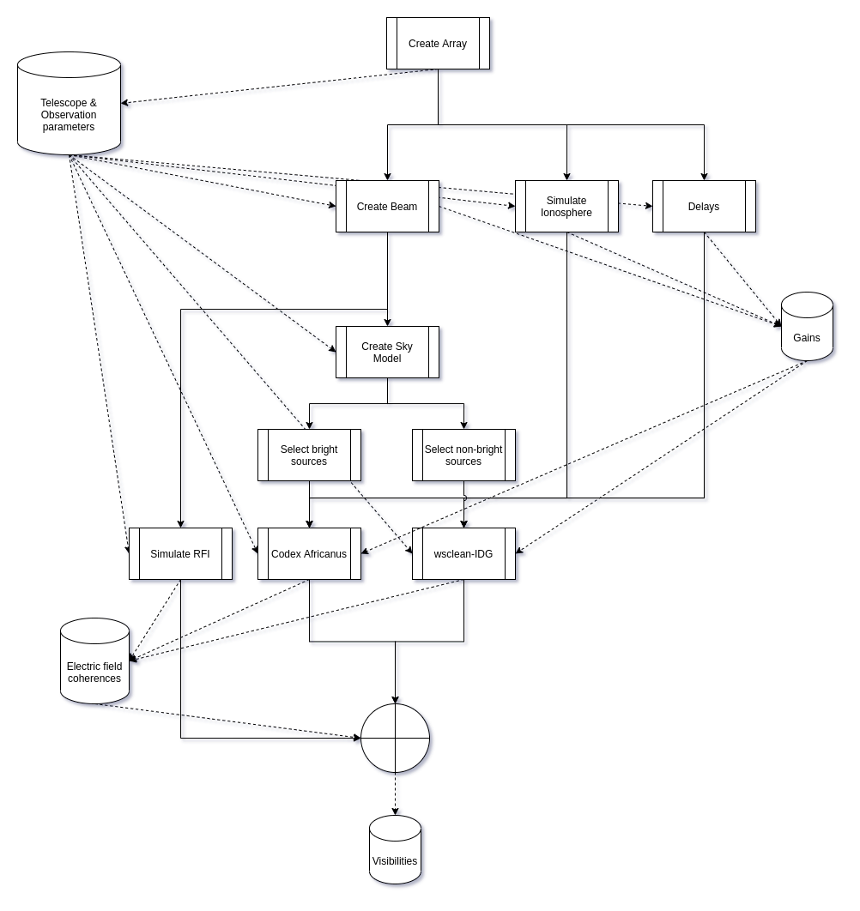

# Overview

Comprehensive Forward Modelling of Visibilities (CFMV -- "see-fom-ve") is a project intended for radio interferometrists who wish to perform accurate simulations of the RIME with realistic corruptions of various types.

This lays out the use cases and general design principles we use in CFMV.

# Representation of simulation

 - We represent the simulation as a pipeline, which consists of modular tasks.
 - Each task produces data products, which can be anything, and which may be used downstream through a shared filesystem which is available at runtime.
 - Each task is containerised with a Dockerfile that describes the environment needed to run the task, and a main entrypoint for the task.
 - Each task can depend on environment variables, and commandline parameters which will be passed to the main entrypoint.

## Pipeline structure

The pipeline structure is given in the below figure. The solid lines depict order of execution dependency, which the dashed lines depict (asynchronous) IO. Each process is run on its own computational instance, and fed by common storage instances. 

## Data representation

The simulation requires two primary types of data. The first are measurement sets (MSs), which contain array parameters and the visibilities ultimately. Since MSs are prehistoric we also require another data type. These are [H5Parms](https://github.com/joshuaalbert/h5parm) for storing gains and similar arrays. 

Each task may use any auxillary data products for their operations, however they will store their main results in one of the above two structures.
All downstream tasks will pull their required information from these types of data structures.

Data structures, whether H5Parms or MSs, are pointed to by global environment variables, and made available to all tasks. It is the responsibility of the team not to concurrently write to these data structures. This is most easily ensure by modularising out the data components. I.e. there is one H5Parm for each task that produces gains, and one MS file for each task that produces electric field coherences.

## Computational resources

Computational resources are registered for the entire pipeline to be run across. We have two types of resources: computational resources, and storage resources. Each resource has a set of capabilities and specifications associated with them. Each task can have certain requirements for run time allocation and these are checked against the available computational resources at schedule time. If a task cannot be scheduled, it will go into queued state. 

## Monitoring tasks

While the pipeline is running and simple view into the computational load of each comptuational resources is available. Computational monitors can be filtered on a per-resource basis, or a per-task basis. Additionally, standard error and standard output are pipeline to log files during task execution and are available to inspect in real-time. A regex-search feature allows searching through the logs.

## Pipeline data products

During pipeline run, data products are stored in special mounted file systems called Data Sources (DSs). These file systems are geographically colocated nearby the computational resources. The pipeline DSs persist after a pipeline run, and can be interacted with through a terminal using a secure tunnel, or a secure remote windows manager. 

Every pipeline run will start with DSs in an identical state. The initial state can be pre-loaded with other data. **Therefore, every pipeline run will produce data products and take up space.**

### Cleaning up storage

The storage instances, where DSs reside, can be monitored, and should be cleaned up periodically. A strong pattern to use is the follow:

  1. Allocate two DSs, one small enough for a single pipeline run, and one very large for archiving.
  2. At the end of each pipeline add a task that moves all desired long-lived data products to the very large DS.
  3. Clean up the first DS.
